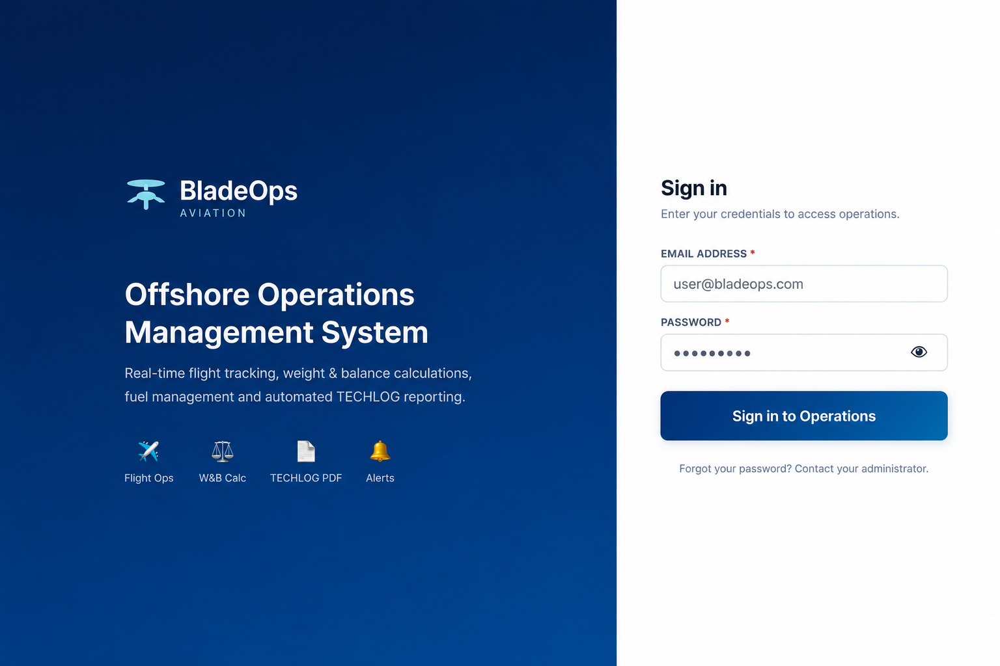
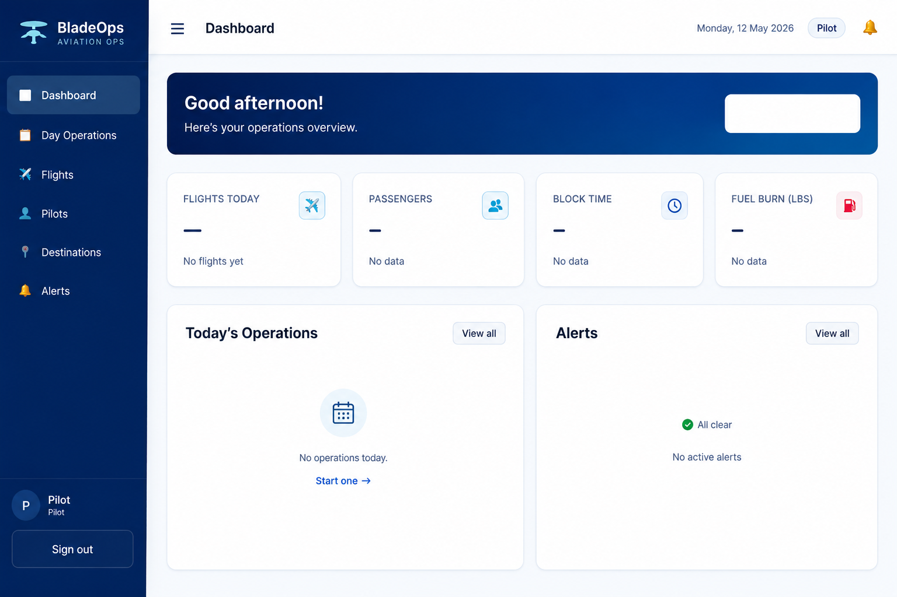

# BladeOps Showcase

BladeOps is an operational management platform focused on aviation and logistics workflows.

## Overview
Designed to support operational teams with efficient tools for managing flights, passengers, cargo, manifests, and operational dashboards.

## Features
- Flight operations management
- Passenger and cargo handling
- Operational dashboards
- Manifest control
- Real-time operational overview
- Operational workflow optimization

## Technologies
- React
- JavaScript
- Python
- API Integration
- Database Management

## Status
🚧 Currently in development.

## Note
This repository is a public showcase version. Sensitive source code and business logic remain private.
